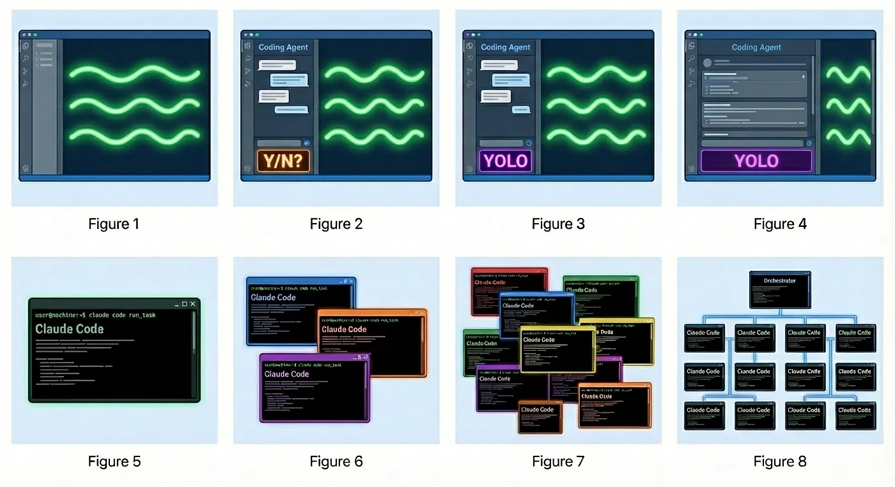

<a id="fr">

    <a href="#en">EN</a> . 
    <a href="#fr">FR</a>

# MiniVibes

***“Premium Is Scarce. Skill Is Not.” (Claude) - v1.1***
---

## Introduction

L’évolution récente (c’est-à-dire des dernières semaines, pas années !) des agents IA et du vibe coding sont un **bouleversement sans précédent dans l’histoire du code**.

Nous entrons dans une ère où savoir vibe coder va devenir aussi important que savoir coder. Aucune formation n’existe encore, c’est un continent inconnu. À vous de le défricher. Ce projet en est une occasion.

## Le projet

Vous avez déjà utilisé un agent IA pour **coder depuis votre terminal**. Si vous savez maîtriser un tel agent, bravo : vous voilà maintenant au stage 5 dans [l’échelle du dev](https://justin.abrah.ms/blog/2026-01-08-yegge-s-developer-agent-evolution-model.html) (ou “Developer-Agent Evolution Model”, cf. image au-dessus)!

Le challenge sera de poursuivre cette lancée et, avec des ressources limitées, de produire les projets les plus aboutis possibles :
- **limitées en temps**, car chaque projet vous prendra une journée seulement,
- **limitées en tokens**, car vous serez toujours sur Copilot, avec un output de tokens limité,
- **limitées en intelligence**, car vous n’aurez pas le luxe d’utiliser des modèles “lourds”.

Votre objectif est de parvenir à reproduire des projets de plus en plus ambitieux, **en n’utilisant qu’une requête “premium” par projet/jour**. Le reste du temps, vous utiliserez un modèle “mini”, avec un multiplicateur de 0.33x (GPT-5.1-Codex-Mini, Claude Haiku 4.5, Gemini 3 Flash…).

En fin de journée, un comparatif des meilleurs projets sera présenté. À chaque fin de journée, un **projet du jour** sera élu par les équipes comme étant le plus abouti.

## J01 - ne lâchez pas les chevaux

**Le projet du premier jour sera de reproduire le jeu https://enclose.horse.**

Vous pouvez utiliser la stack de votre choix. Le site doit pouvoir tourner sur un navigateur Web. **Soyez très attentifs à toutes les fonctionnalités proposées**, elles ne sont pas toutes évidentes ! Passez déjà du temps à bien l’observer, comprendre son fonctionnement et ses finesses (graphiques, autres).

Une fois le site reproduit, vous êtes invités, bien sûr, à l’améliorer.

Les autres projets vous seront communiqués à chaque début de journée.

## Contraintes

Vous fonctionnerez en deux temps : d’abord, vous ferez rédiger une **spécification complète** par votre agent. Vous devrez **vérifier la cohérence et la faisabilité** de cette spécification avant de la valider. Une fois validée, cette spécification constituera le **contexte principal** pour l’agent tout au long de la production du projet.

### Éléments attendus dans la spécification :

1. **Découpage fonctionnel et technique** (front-end/back-end, modules ou composants principaux : UI, moteur de jeu, API, stockage…)
2. **Stack technique** (langages/frameworks/libs, DB et schéma simplifié, gestionnaire de packages, outils de build, de mise en forme, de test..)
3. **Contraintes et ressources** (limite des requêtes premium / mini utilisées par jour, éventuellement restrictions de performance…)
4. **Règles de rendu et de fidélité** (objectif visuel ou comportemental précis à atteindre, critères de succès minimal pour considérer un module fonctionnel, tests/vérifications automatisables)
5. **Organisation du projet** (structure des fichiers et conventions de nommage)
6. **Stratégie de développement** (étapes à générer en premier, étapes de validation, gestion du contexte)

### Voici les contraintes :

- Vous devez avoir un fichier `COPILOT.md` dans votre projet
- Vous devez pouvoir montrer tous vos prompts
- Aucun code ne doit provenir d’ailleurs que de votre agent
- Vous devez versionner intelligemment votre code avec Git
- Idéalement, votre projet est dockerisé (mais ça n’est pas une obligation absolue, notamment si vous ne faites pas de Web)
- À la fin de votre session, vous devez créer un fichier `SESSION.md`
contenant le résultat de la commande /session

### Bonus :

- Vous utilisez plusieurs agents, avec des [Git worktrees](https://git-scm.com/docs/git-worktree)
- Votre projet a des tests unitaires
- Votre projet est non-injectable et non-attaquable trivialement
(injection SQL, XSS, input validation…)
- Votre code est formaté correctement et de façon homogène sur tout le projet. Vous pouvez montrer qu’un système de formatage est en place
- Vous utilisez une base de données quand cela est pertinent
(relationnelle, NoSQL…)

## Compétences visées

- Vibe coding
- Prompting

## Rendu

Le projet est à rendre sur votre github : https://github.com/prenom-nom/minivibes

## Base de connaissances

- https://justin.abrah.ms/blog/2026-01-08-yegge-s-developer-agent-evolution-model.html
- https://x.com/bcherny/status/2015979257038831967
- https://git-scm.com/docs/git-worktree

<a id="en">

    <a href="#en">EN</a> . 
    <a href="#fr">FR</a>

# MiniVibes

***“Premium Is Scarce. Skill Is Not.” (Claude) - v1.1***
---

## Introduction

The recent evolution (i.e., over the last few weeks, not years!) of AI agents and vibe coding represents an **unprecedented transformation in the history of code**.

We are entering an era where knowing how to vibe code will become as important as knowing how to code. No training exists yet; it's an unknown continent. It's yours to explore. This project is an opportunity to do so.

## The Project

You have already used an AI agent to **code from your terminal**. If you can master such an agent, congratulations: you are now at stage 5 on the [developer scale](https://justin.abrah.ms/blog/2026-01-08-yegge-s-developer-agent-evolution-model.html) (or "Developer-Agent Evolution Model", see the image above)!

The challenge will be to continue this momentum and, with limited resources, produce the most ambitious projects possible:
- **limited in time**, because each project will take you only one day,
- **limited in tokens**, because you will always be on Copilot, with limited token output,
- **limited in intelligence**, because you won't have the luxury of using "heavy" models.

Your goal is to achieve increasingly ambitious projects, **using only one "premium" request per project/day**. The rest of the time, you will use a "mini" model, with a 0.33x multiplier (GPT-5.1-Codex-Mini, Claude Haiku 4.5, Gemini 3 Flash…).

At the end of the day, a comparison of the best projects will be presented. At each end of day, a **project of the day** will be elected by the teams as the most accomplished.

## D01 - Don't Hold Back

**The first day's project will be to reproduce the game https://enclose.horse.**

You can use the tech stack of your choice. The site must be able to run in a Web browser. **Pay close attention to all the features offered**, they are not all obvious! Spend time observing it well, understanding its operation and its subtleties (graphics, etc.).

Once the site is reproduced, you are invited, of course, to improve it.

Other projects will be communicated to you at the start of each day.

## Constraints

You will work in two phases: first, you will have your agent write a **complete specification**. You must **verify the coherence and feasibility** of this specification before validating it. Once validated, this specification will constitute the **main context** for the agent throughout the project production.

### Expected elements in the specification:

1. **Functional and technical breakdown** (front-end/back-end, main modules or components: UI, game engine, API, storage…)
2. **Technical stack** (languages/frameworks/libs, DB and simplified schema, package manager, build tools, formatting, testing…)
3. **Constraints and resources** (limit of premium/mini requests used per day, possibly performance restrictions…)
4. **Rendering and fidelity rules** (precise visual or behavioral objective to achieve, minimal success criteria to consider a module functional, automated tests/verifications)
5. **Project organization** (file structure and naming conventions)
6. **Development strategy** (stages to generate first, validation stages, context management)

### Here are the constraints:

- You must have a `COPILOT.md` file in your project
- You must be able to show all your prompts
- No code should come from anywhere other than your agent
- You must intelligently version your code with Git
- Ideally, your project is dockerized (but this is not an absolute requirement, especially if you don't do Web)
- At the end of your session, you must create a `SESSION.md` file
containing the output of the /session command

### Bonus:

- You use multiple agents with [Git worktrees](https://git-scm.com/docs/git-worktree)
- Your project has unit tests
- Your project is non-injectable and not trivially attackable
(SQL injection, XSS, input validation…)
- Your code is formatted correctly and consistently throughout the project. You can show that a formatting system is in place
- You use a database when relevant
(relational, NoSQL…)

## Target Skills

- vibe coding
- prompting

## Submission

The project is to be submitted on your github: https://github.com/firstname-lastname/minivibes

## Knowledge Base

- https://justin.abrah.ms/blog/2026-01-08-yegge-s-developer-agent-evolution-model.html
- https://x.com/bcherny/status/2015979257038831967
- https://git-scm.com/docs/git-worktree
